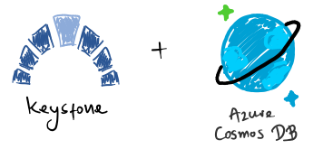

# Azure Cosmos DB Store



## Overview

You can configure Keystone to point to an [Azure Cosmos DB](https://docs.microsoft.com/en-us/azure/cosmos-db/introduction) service.
Keystone will attempt to create its a database container and tables upon startup
if they do not yet exist.  Please read further to learn how to configure Keystone
with an Azure Cosmos DB store.

## Prerequisites

You'll need to ensure the following criteria are met:

* **_Keystone_ can reach Cosmos DB**: It may go without saying, but your Cosmos DB account will have to be
  eachable by your *Keystone* deployment.  If your Cosmos DB account is gated in a VNet, ensure network constraints
  allow *Keystone* to work with your Cosmos DB account.

## Authentication

*Keystone* can authenticate with Cosmos DB in one of the following ways:

* **Managed Identity (highly recommended):** In case you're deploying *Keystone* to a container runtime environment
  in Azure (e.g., [Azure Kubernetes Service](https://azure.microsoft.com/en-us/services/kubernetes-service/), [Azure Container Apps](https://azure.microsoft.com/en-us/services/container-apps/))
  it is highly recommended to set up a managed identity for the service running the *Keystone* container(s), and assign
  RBAC roles that allow it to interact with your Cosmos DB service.
    * [Read more on Azure Managed Identities](https://docs.microsoft.com/en-us/azure/active-directory/managed-identities-azure-resources/overview).
* **Account Keys:** Cosmos DB allows you to generate account keys with which you can make authenticated Cosmos DB requests.
    * If you opt to use this authentication method, it's recommended that you rotate the Cosmos DB account keys often.
    * [Read more on Cosmos DB Account Keys](https://docs.microsoft.com/en-us/azure/cosmos-db/secure-access-to-data?tabs=using-primary-key#primary-keys).

## Example

The following YAML file and environment variables is a valid way to configure *Keystone* to point to
your Cosmos DB account as its data store, using an Azure Managed Identity (assuming *Keystone* runs on azure,
e.g., on [AKS]((https://azure.microsoft.com/en-us/services/kubernetes-service/))).

Create a file and call it `keystone_config.yaml`:

```yaml
store:
  cosmos:
    account_uri: https://myscim2pool.documents.azure.com:443/
```

Run the container, while bind-mounting the configuration file as a volume, along with
environment variables for secrets:

```shell
docker run -it \
  -p 5001:5001 \
  --mount type=bind,source="$(pwd)"/keystone_config.yaml,target=/etc/keystone_config.yaml
  -e AUTHENTICATION_SECRET="<extra secret bearer token>" \
  -e CONFIG_PATH=/etc/keystone_config.yaml
  ghcr.io/keystone-scim/keystone:latest
```
!!! note "Running on Azure? Use Azure Key Vault"

    If you're using Azure, you can leverage [Azure Key Vault](https://docs.microsoft.com/en-us/azure/key-vault/)
    to store *Keystone*'s bearer token. If you set up a managed identity for *Keystone* to consume secrets
    from an Azure Key Vault, your configuration could look like so:
    
    ```yaml
    store:
      cosmos:
        account_uri: https://myscim2pool.documents.azure.com:443/
    authentication:
      akv:
        vault_name: my-akv-name
        secret_name: my-bearer-token-secret-name
    ```

    If you're using AKV, don't forget to omit the `AUTHENTICATION_SECRET` environment variable from the container.