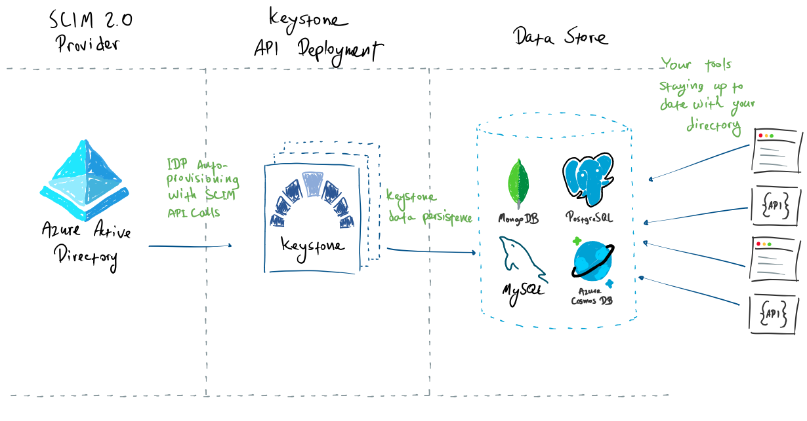

# Welcome to Keystone

Welcome to the official *Keystone* Documentation.

## What's Keystone?

*Keystone* is a fully containerized lightweight SCIM 2.0 API implementation.
Whether you're using one of the prominent cloud identity managers such as
Azure Active Directory, Okta, Auth0, etc., or another identity provider that supports
automatic provisioning with SCIM 2.0, you can use *Keystone* to quickly store
the state of directory in a [data store](#supported-data-store).

## Supported Data Store

As *Keystone* is an entirely stateless workload, it expects you to bring your own
storage layer, and it'll take care of the nitty-gritty details, such as schema
and tables creation.  All you have to do is provision a supported data store in
a network location that your *Keystone* container can reach.

*Keystone* currently supports the following data stores:

  * [Azure Cosmos DB](https://docs.microsoft.com/en-us/azure/cosmos-db/introduction)
  * [PostgreSQL](https://www.postgresql.org) (version 10 or higher)
  * [MongoDB](https://www.mongodb.com/docs/) (version 3.6 or higher)
  * An in-memory store for **testing purposes only**.

*Keystone* is slated to support the following data stores, in descending order of implementation
priority:

  * Azure AD B2C Tenants
  * MySQL
  * Redis
  * Microsoft SQL
  * AWS DynamoDB

## Supported Authentication Methods

While the SCIM 2.0 protocol itself
[doesn't define SCIM-specific scheme for authentication](https://datatracker.ietf.org/doc/html/rfc7644#section-2),
most prominent identity managers allow you to specify a bearer token that they'll use in the `Authorization` HTTP header in their requests against SCIM 2.0 APIs.

*Keystone* currently allows you to specify that secret bearer token in two places:

* In an [Azure Key Vault](https://azure.microsoft.com/en-us/services/key-vault/) secret.
* In an environment variable (`AUTHENTICATION_SECRET`).

Read more on [how to configure *Keystone*](./configuration.md) to use either authentication methods.
