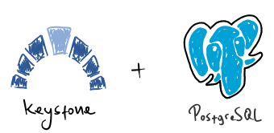

# PostgreSQL Store



## Overview

You can configure Keystone to point to a [PostgreSQL](https://www.postgresql.org/) server,
wherever it may reside. Keystone will attempt to create its database objects upon startup
if they do not yet exist.  Please read further to learn how to configure Keystone
with a PostgreSQL server.

## Prerequisites

You'll need to ensure the following criteria are met:

* **PostgreSQL 10 or higher**: Keystone makes use of PostgreSQL features available
  in PostgreSQL version 10 or higher (e.g., `ILIKE` comparisons and the `CITEXT` extension).
* **The ability to install the [CITEXT extension](https://www.postgresql.org/docs/current/citext.html)**:
  Some managed database services (such as
  [Azure Database for PostgreSQL - Flexible Server](https://docs.microsoft.com/en-us/azure/postgresql/flexible-server/concepts-extensions))
  require adminsitrators to allow certain extensions explicitly.  Check that your PostgreSQL instance
  allows the creation of the `CITEXT` extension.
* **Permissions for workload user**: the user running the workload will have to own the schema Keystone is configured to
  run in.  If the schema doesn't exist, Keystone will try to create a schema under that name.

## Example

The following YAML file and environment variables is a valid way to configure *Keystone* to point to
your PostgreSQL database as its data store.

Create a file and call it `keystone_config.yaml`

```yaml
store:
  pg:
    host: my.postgresql.server.com
    port: 5432
    username: keystone_api_user
    database: scim_2_db
    schema: public
    ssl_mode: require
```

Run the container, while bind-mounting the configuration file as a volume, along with
environment variables for secrets:

```shell
docker run -it \
  -p 5001:5001 \
  --mount type=bind,source="$(pwd)"/keystone_config.yaml,target=/etc/keystone_config.yaml
  -e AUTHENTICATION_SECRET="<extra secret bearer token>" \
  -e STORE_PG_PASSWORD="<extra secret postgres password>" \
  -e CONFIG_PATH=/etc/keystone_config.yaml
  ghcr.io/keystone-scim/keystone:latest
```